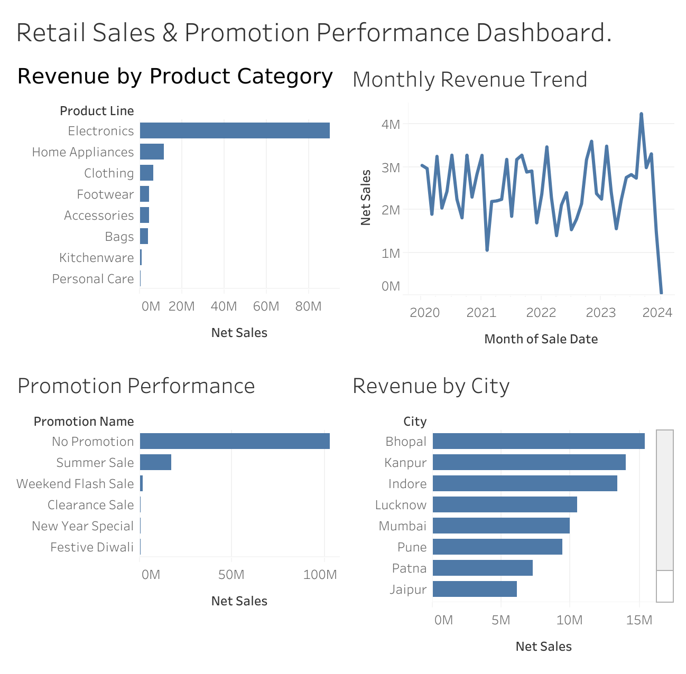

# Retail Sales & Promotion Effectiveness Analysis

An end-to-end data analytics project examining retail sales performance and promotion effectiveness for a mid-sized retailer, built from a real transactional dataset (~3,500 sales records across 50 customers, 30 products, and 5 promotions).

**Business question:** Which products and promotions actually drive revenue, and where should the business focus next quarter?

🔗 **[Live Interactive Dashboard (Tableau Public)](https://public.tableau.com/app/profile/jaagrit.sachdeva/viz/RetailSalesPromotionPerformanceAnalysis/RetailSalesPromotionPerformanceDashboard_?publish=yes)**



## Project Overview

This project models raw retail transaction data into a proper star schema, cleans real-world data quality issues, calculates business metrics from scratch, and surfaces actionable insights through SQL analysis and an interactive Tableau dashboard.

## Tech Stack
- **MySQL** — relational database design, data cleaning, business query writing
- **MySQL Workbench** — schema design, ETL (staging → cleaned tables)
- **Tableau Public** — interactive dashboard

## Dashboard

The dashboard combines four views into a single page:
- **Revenue by Product Category** — which product lines drive the most revenue
- **Monthly Revenue Trend** — how revenue moves over time
- **Promotion Performance** — how each promotion compares, including "No Promotion" as a baseline
- **Revenue by City** — top 10 cities by revenue

👉 [Open the live dashboard here](https://public.tableau.com/app/profile/jaagrit.sachdeva/viz/RetailSalesPromotionPerformanceAnalysis/RetailSalesPromotionPerformanceDashboard_?publish=yes)

## Data Model

A star schema with one fact table and three dimension tables:

- `fact_sales` — individual sales transactions (date, customer, product, promotion, units sold, pricing, discounts)
- `dim_customers` — 50 customers (name, city, state, contact info)
- `dim_product` — 30 products across 8 categories
- `dim_promotion` — 5 promotions (type, discount rule, coupon code)

## Data Cleaning Challenges Solved

Real transactional data rarely arrives analysis-ready. Key issues identified and fixed:

- **Mislabeled date format**: the source column was labeled dd/mm/yyyy but was actually stored as m/d/yyyy — confirmed by cross-checking rows with day values above 12, then corrected with `STR_TO_DATE`.
- **Incomplete transaction records**: `Price Per Unit`, `Total Sales`, `Discount %`, `Discount Value`, and `Net Sales` were empty in the raw data — calculated by joining product prices and applying each promotion's discount rule.
- **Invalid foreign key values**: `PromotionID = 0` was used to represent "no promotion," which isn't a valid ID — converted to `NULL` to correctly reflect no promotion applied.
- **Comma-formatted prices**: product prices like "1,299.00" broke CSV imports since commas are the field delimiter — imported as text first, cleaned with `REPLACE()`, then converted to a numeric type.
- **Inconsistent whitespace**: trailing spaces in city/state fields (a common Excel export artifact) were trimmed to prevent incorrect groupings in analysis.

## Key Findings

1. **Electronics dominates revenue** — 5 of the top 10 products by revenue are electronics, led by the Apple iPhone 14 (₹21.4M), despite similar unit volumes to other top sellers. Price point, not volume, is driving revenue concentration.

2. **Promotions don't meaningfully increase basket size.** Average units per transaction stays roughly flat (~2.0) whether a promotion is running or not. This suggests current promotions may be discounting purchases customers would have made anyway, rather than driving genuinely incremental spend.

3. **Revenue is geographically concentrated in mid-size cities**, not just major metros — Bhopal and Kanpur outperform Mumbai and Delhi in total revenue.

4. **Monthly revenue is volatile, not steadily trending** — swinging between ~₹1M and ₹3.5M month to month, indicating demand is driven by short-term factors rather than sustained growth.

## Business Recommendations

- **Re-evaluate promotion design**: since current promotions don't lift basket size, consider testing promotions with a minimum spend threshold to drive genuinely incremental revenue rather than subsidizing existing demand.
- **Investigate demand drivers behind monthly volatility** to enable better inventory and staffing planning.
- **Explore why mid-size cities outperform**, and consider whether marketing spend allocation should shift accordingly.

## Repository Structure

```
retail-sales-analysis/
├── README.md
├── SQL/
│   ├── 01_schema_creation.sql
│   ├── 02_data_cleaning.sql
│   ├── 03_fact_table_population.sql
│   └── 04_business_queries.sql
└── dashboard/
    └── dashboard_screenshot.png
```
